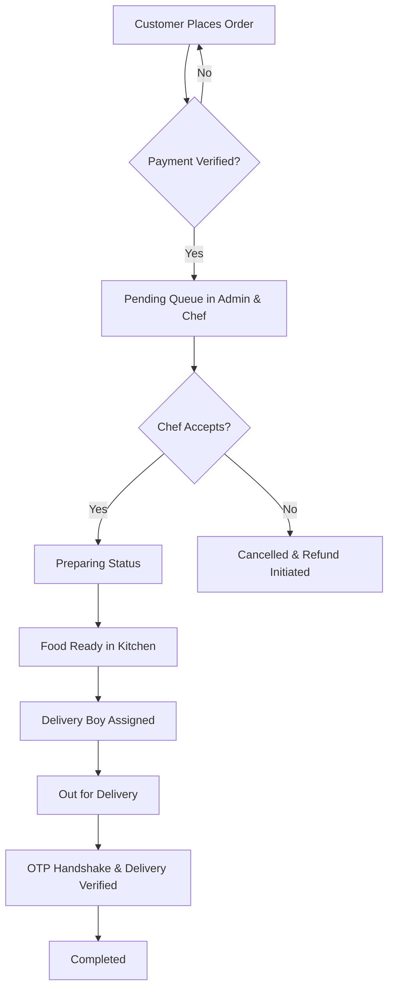

# Software Requirement Specification (SRS) - Parabdi

## 1. Project Purpose & Overview

### Project Name
**Parabdi**

### Project Type
Pure Vegetarian Gujarati Cloud Kitchen Food Ordering System

### Platform
* Android & iOS (Flutter customer mobile application)
* Admin Web Panel (React / Next.js)
* Chef Panel (Flutter / Web)
* Delivery Boy Panel (Flutter mobile application)

### Description
Parabdi is a specialized, pure-vegetarian Gujarati cloud kitchen platform designed to connect food lovers with authentic traditional and modern Gujarati cuisine. The system allows customers to register/login, select delivery location, browse/search food, view today's specials, watch food shorts, customize food, apply coupons, place orders, make payments, track active delivery location, buy subscription plans, and submit ratings/reviews. 

The architecture is designed to be highly scalable so that external delivery providers can be integrated later without altering the core order system.

---

## 2. Objectives
* Promote authentic, high-quality vegetarian Gujarati cuisine.
* Streamline cloud kitchen logistics and reduce manual order management.
* Offer flexible subscription plans (daily/weekly) for corporate employees, students, and households.
* Enable high-fidelity real-time order tracking using WebSockets (Socket.IO).
* Support secure cashless payments (Razorpay) alongside optional cash-on-delivery.
* Engage users through media-rich features like "Food Shorts" (recipe reels, behind-the-scenes).

---

## 3. Important Development Rule
Do NOT start development by randomly creating screens or APIs. The strict development order must be followed:
1. Finalize client decisions
2. Finalize business rules
3. Finalize database architecture
4. Finalize API architecture
5. Finalize user/chef/rider/admin flows
6. Design UI/UX
7. Develop backend
8. Develop customer app
9. Develop chef panel
10. Develop rider app
11. Develop admin panel
12. Integrate payment
13. Integrate notification
14. Integrate maps/live location
15. Integrate external delivery provider if required
16. Testing
17. Deployment

---

## 4. Client Decisions Required Before Final Development
The following details must be confirmed by the Parabdi client:

### Business
* [ ] Exact business name
* [ ] Kitchen address
* [ ] Delivery area & delivery radius
* [ ] Kitchen opening & closing time
* [ ] Lunch timing & dinner timing
* [ ] Pure vegetarian confirmation
* [ ] Gujarati-only or multiple cuisines
* [ ] Jain food availability
* [ ] Pickup availability
* [ ] Minimum order value
* [ ] Delivery charges & free delivery conditions
* [ ] GST applicability
* [ ] Cancellation & refund policies

### Payment
* [ ] UPI
* [ ] Credit/Debit Card
* [ ] Net Banking
* [ ] Cash on Delivery
* [ ] Payment gateway
* [ ] Partial payment if required

### Delivery
* [ ] Own delivery boys, external delivery provider, or both
* [ ] Delivery OTP requirement
* [ ] Customer live tracking
* [ ] Rider calling
* [ ] Scheduled delivery
* [ ] Delivery zones

### Subscription
* [ ] Subscription requirement & type (number of meals, duration)
* [ ] Discounting & free delivery conditions
* [ ] Auto renewal
* [ ] Cancellation/refund rules

### Marketing
* [ ] Coupons & offers
* [ ] Referrals & loyalty points
* [ ] Festival offers
* [ ] Push notifications

### Language
* [ ] Gujarati only
* [ ] Gujarati + English (Recommended: Gujarati default + English option)

---

## 4A. Default Values for Development

Until the client confirms the above decisions, the following **default values** will be used for development and testing. These can be updated via the Admin Settings panel once confirmed.

### Business Defaults

| Setting | Default Value | Notes |
|---------|--------------|-------|
| Business Name | Parabdi | Pure Veg Gujarati Cloud Kitchen |
| Kitchen Address | Ahmedabad, Gujarat | Exact address TBD |
| Delivery Radius | 5 km | From kitchen center point |
| Kitchen Opening Time | 08:00 AM | Configurable |
| Kitchen Closing Time | 10:00 PM | Configurable |
| Lunch Timing | 12:00 PM - 2:00 PM | Configurable |
| Dinner Timing | 7:00 PM - 9:00 PM | Configurable |
| Pure Vegetarian | Yes | Enforced in DB: `is_veg = TRUE` constraint |
| Jain Food Available | Yes | Marked per food item |
| Pickup Available | No | Delivery only for MVP |
| Minimum Order Value | ₹100 | Below this, checkout blocked |
| Delivery Fee | ₹30 | Free above ₹200 |
| Free Delivery Threshold | ₹200 | Configurable |
| GST Rate | 5% | Applied on item total |
| Platform Fee | ₹2 | Fixed per order |
| Cancellation Window | Before chef accepts | Once `confirmed`, cannot cancel |
| Refund Method | Wallet credit | Original method for Razorpay (future) |

### Payment Defaults

| Setting | Default Value |
|---------|--------------|
| UPI | Enabled |
| Credit/Debit Card | Enabled |
| Net Banking | Enabled |
| Cash on Delivery | Enabled |
| Payment Gateway | Razorpay (test mode) |

### Subscription Defaults

| Setting | Default Value |
|---------|--------------|
| Cutoff Time for Skip | 9:00 AM |
| Auto Renewal | No (manual renewal) |
| Cancellation Refund | Pro-rated wallet credit |
| Max Active Subscriptions | 1 per user (same meal type) |

### OTP Defaults

| Setting | Default Value |
|---------|--------------|
| OTP Length | 6 digits |
| OTP Expiry | 5 minutes (300 seconds) |
| Max OTP Attempts | 3 per OTP |
| Max OTP Requests | 3 per phone per 10 minutes |

### Delivery Module Scope

> **MVP DECISION:** The Delivery Boy / Rider module is **OUT OF SCOPE** for MVP.
> - No rider app will be built for MVP
> - No live GPS tracking will be implemented
> - Orders end at `ready` status — customer picks up or staff delivers manually
> - Order status flow for MVP: `placed → confirmed → preparing → ready → delivered`
> - The delivery-related database tables and API endpoints are documented but NOT implemented for MVP
> - Rider module can be added as a post-MVP Change Request

### Location Selection Specification

**Customer App (Flutter):**
- Use `geolocator` package for GPS-based current location detection
- No Google Places SDK in the Flutter app
- User can: auto-detect GPS, manually drag map pin, or type address manually
- Coordinates (lat/lng) sent to backend for geofence validation

**Backend (NestJS):**
- Expose `POST /api/v1/places/search` endpoint using Google Places API (server-side)
- Flutter calls this endpoint when user types in address search field
- Backend returns autocomplete suggestions with coordinates
- Backend validates delivery radius using Haversine formula against kitchen coordinates

---

## 5. Client Content Required
The client must provide the following branding and menu assets:

### Branding
* Logo (SVG/PNG)
* Brand colors & typography guidelines

### Food (Per Dish)
* Food name (Gujarati & English)
* Description & ingredients
* Price & discount
* Category
* Food image & video (if available)
* Preparation time & serving size
* Availability status & Jain options availability
* Customization options & Add-ons
* Today's Special & Best Seller status

### Business & Legal
* Address, phone, WhatsApp number, and email
* Business timings
* Terms & Conditions, Privacy Policy, Refund Policy, Cancellation Policy, and Shipping/Delivery Policy

---

## 6. User Roles & Capabilities

### 6.1 Customer
* **Auth:** Register and login via Mobile OTP or Social Providers (Google). Passwordless OTP auth must not store raw passwords on the backend.
* **Browsing:** Navigate categorized dishes, search by dish/category, filter by dietary requirements (Veg, Jain, Fasting), spice levels, and sort by rating/price.
* **Food Shorts:** View quick behind-the-scenes reels or recipe videos, liking, saving, sharing, and using "Order Now" to navigate to details.
* **Customization:** Customize ingredients, spice levels, sizing (Half/Full), cooking preferences, and add-ons.
* **Cart & Checkout:** Manage cart items, apply coupons, add delivery tips, select saved addresses, select delivery timeslots, and make payments.
* **Subscriptions:** Purchase and manage subscription meal plans (pause, resume, skip specific meals).
* **Tracking:** Real-time visual tracking of orders (Placed → Confirmed → Preparing → Ready → Out for Delivery → Delivered).
* **History & Wishlist:** Maintain a wishlist of favorite meals and view order logs with reorder capability.
* **Reviews:** Rate and review meals with written comments.

### 6.2 Chef
* **Queue Management:** View, accept, or reject incoming orders.
* **Cooking Pipeline:** Update cooking status (Preparing → Ready) in real time.
* **Inventory Control:** Manage food availability (Toggle in stock / out of stock) if permission is granted.
* **Today's Special:** Set highlighted items for the customer homepage if permitted.
* **Restrictions:** Cannot change payment settings, customer profiles, system parameters, prices (unless authorized), or manage administrators.

### 6.3 Delivery Boy (Rider) [TEMPORARILY REMOVED / COMMENTED OUT]
<!--
* **Duty Toggle:** Go online/offline to accept delivery requests.
* **Order Logistics:** Accept assigned order deliveries, use built-in Google Maps navigation, view customer address details, and verify delivery via OTP sent to the customer.
* **Live Location:** Share live GPS location details during active delivery transit only.
* **Financial Ledger:** View daily/weekly earnings summaries and delivery history.
-->
*(Note: Delivery Boy / Rider module is temporarily removed from active development scope.)*

### 6.4 Admin
* **Dashboard:** Unified analytics showing total revenue, sales velocity, order metrics, active subscribers, and operational heatmaps.
* **Content Management:** Create/edit categories, food items, upload product photos/videos (shorts/banners), and manage banner slides.
* **User & Staff Management:** Management of Chefs and Delivery Boys (CRUD operations, access activation).
* **Customer Support:** Review feedback, manage wallet credits, issue refunds, and resolve complaints.
* **Coupon & Promotions:** Setup and manage discount coupons (percentage, flat, free delivery).
* **Global Configuration:** Manage system parameters like GST rate, kitchen hours, delivery radius thresholds, and minimum order values.

---

## 7. Location & Customization Matrix

### Location Services
* Current location detection using geolocation.
* Address book mapping for saved coordinates (Home, Office, Other).
* Geofencing validation against the kitchen's delivery radius.

### Food Customization Matrix
* Customizations must be dynamic and configured from the Admin Panel, not hard-coded in the mobile app.
* **Portion Control:** Half / Full, Small / Medium / Large.
* **Add-ons:** Ghee, Butter, Cheese, Salad, Chutney, Extra Roti/Rice.
* **Cooking Preferences:** Less Oil, Less Spicy, Jain Preparation (No Onion, No Garlic).
* **Custom Notes:** Text field for delivery instructions or spice specifications.

---

## 8. Subscription Architecture
Customers can subscribe to the following predefined structures:

| Plan Name | Frequency | Volume | Description |
| :--- | :--- | :--- | :--- |
| **Daily Lunch Plan** | 30 Days | 30 Meals (1/day) | Fixed monthly lunch subscription ideal for office workers and students. |
| **Daily Lunch + Dinner** | 30 Days | 60 Meals (2/day) | Full monthly coverage (Lunch & Dinner) for complete nutrition. |
| **Complete Daily Plan** | 30 Days | 90 Meals (3/day) | Complete coverage including Breakfast, Lunch, and Dinner. |
| **Weekly Lunch Plan** | 7 Days | 7 Meals (1/day) | Flexible short-term plan to test the kitchen services. |

*Subscribers can pause, resume, or skip tomorrow's delivery before the kitchen cutoff time (e.g., 9:00 AM).*

---

## 8A. Edge Case Business Rules

### Cart & Checkout Edge Cases

| Scenario | Rule |
|----------|------|
| Coupon discount exceeds order total | Discount capped at item total (grand total cannot go below ₹0) |
| Apply coupon then remove item below minimum | Coupon auto-removed, recalculate total |
| Cart item becomes unavailable after adding | Show warning, block checkout, require item removal |
| Multiple coupons applied | Only ONE coupon per order |
| Wallet balance covers full order | Auto-apply wallet payment, skip Razorpay |
| Wallet balance partially covers order | Split payment: wallet first, then Razorpay for remainder |
| All items out of stock | Block checkout, show "Kitchen temporarily unavailable" |
| User tries to order from outside delivery radius | Block checkout, show "Currently unavailable in your area" |
| User tries to order when kitchen is closed | Block checkout, show "Kitchen is currently closed" |

### Order Edge Cases

| Scenario | Rule |
|----------|------|
| Payment webhook arrives after timeout | Retry up to 3 times, then mark for manual review |
| Chef rejects order after payment | Auto-refund to original payment method or wallet |
| Customer cancels after chef confirms | Block cancellation, show "Order already being prepared" |
| Customer cancels before chef confirms | Allow cancellation, full refund |
| Multiple orders from same user simultaneously | Allowed (up to 3 active orders) |
| Order placed during maintenance mode | Block with "System under maintenance" message |

### Subscription Edge Cases

| Scenario | Rule |
|----------|------|
| Skip meal after cutoff time (9 AM) | Block skip, show "Cutoff time passed" |
| Pause subscription with pending delivery | Pause starts from next day |
| Resume paused subscription | Reactivate from next eligible day |
| Cancel subscription with remaining meals | Pro-rated refund to wallet |
| Multiple subscriptions same meal type | Block — only 1 active subscription per meal type |
| Subscription expires with meals remaining | Remaining meals forfeited, no refund |
| Subscription payment fails | Subscription stays inactive until payment succeeds |

### Coupon Edge Cases

| Scenario | Rule |
|----------|------|
| Expired coupon applied | Reject with "Coupon has expired" |
| Coupon usage limit reached | Reject with "Coupon usage limit reached" |
| First-order coupon on returning customer | Reject with "Coupon valid for first order only" |
| Coupon minimum not met | Reject with "Minimum order value ₹X required" |
| Category-restricted coupon on wrong category | Reject with "Coupon not applicable to selected items" |

### Review Edge Cases

| Scenario | Rule |
|----------|------|
| Review without order for that food | Block — must have ordered the item |
| Duplicate review for same food+order | Block — one review per food per order |
| Rating without comment | Allowed (comment is optional) |
| Review image exceeds 3MB | Reject with "Image too large" |
| More than 5 review images | Reject with "Maximum 5 images allowed" |

### Address Edge Cases

| Scenario | Rule |
|----------|------|
| Address outside delivery radius | Allow saving but block checkout for that address |
| Maximum addresses per user | 10 addresses |
| Delete address used in active order | Allow (order retains address snapshot) |
| Set default address | Unset previous default, set new one |

---

## 9. Payment & Charges Breakdown

### Checkout Charges
$$\text{Grand Total} = \text{Item Total} + \text{GST (5\%)} + \text{Delivery Fee} + \text{Platform Fee} - \text{Discount Code}$$

### Integrated Methods
* UPI (GPay, PhonePe, Paytm, etc.)
* Credit/Debit Cards
* Net Banking / Digital Wallets (including in-app Wallet credit)
* Razorpay Payment Gateway integration

---

## 10. Operational Flow Chart

---

## 11. Technical Stack
* **Mobile Frontend:** Flutter (Android/iOS)
* **Web Frontend:** React.js / Next.js (Admin & Web interfaces)
* **State Management:** Riverpod + Freezed (Mobile)
* **Backend:** Node.js (TypeScript + NestJS modular architecture)
* **Database:** PostgreSQL
* **Realtime Communication:** Socket.IO
* **Cloud Storage:** AWS S3 / Cloudinary (assets, videos)
* **Push Notifications:** Firebase Cloud Messaging (FCM)

---

## 12. What Upparac Decides
Upparac should independently decide:
* UI layout, UX, and navigation
* Component structure and responsive behavior
* Database technical structure & relational indexes
* REST API endpoints & NestJS backend architecture
* Security practices, CORS, rate limits, and headers
* Code organization & technical libraries
* Loading/empty states and error handling

---

## 13. What Client Must Decide
Client must decide:
* Food, pricing, categories, and customizations
* Delivery policy, radius, and timing rules
* Payment methods, COD rules, and gateway credentials
* Subscription models & benefits
* Coupon/offer rules, refund, and cancellation policies
* Branding assets (logos, colors, fonts)
* Legal documents & language selections

---

## 14. Change Request Policy
After client approval of business requirements, flows, UI/UX, and database structure, any new features (e.g., catering, corporate orders, digital wallets, loyalty schemes, or new delivery providers) must be evaluated as formal Change Requests and not silently added to the original project scope.

---

## 15. MVP Recommendation
For the initial launch, the MVP must prioritize:
1. Registration & login
2. Location & serviceability checks
3. Home feed & categories
4. Menu browsing & details with customizations
5. Cart & checkout calculations
6. Payment integration & order creation
7. Chef & Rider workflows
8. Live location tracking
9. Admin panel & Notifications

Advanced features (shorts, subscription plans, coupons, wishlist, reviews, referrals) can be developed subsequently based on priority.

---

## 16. Definition of Done
Parabdi is ready for production only when:
* Customer can register/login, select address, browse menu, customize, add to cart, and pay.
* Payment verification is performed server-side.
* Order successfully reaches the Chef, who accepts and prepares it.
* Rider is assigned, picks up the order, and starts GPS sharing.
* Live location coordinates display on the customer tracking map.
* Delivery completes via OTP verification handshake.
* Order history and reordering capabilities function correctly.
* Admin dashboard reports work, and notification pipelines trigger.
* Error handling and security checks pass successfully.
* Production database is configured with automated daily backup strategies.
* Client explicitly approves the final production build.

---

## 17. Final Client Approval Checklist
Before starting final production development, obtain formal client sign-off on:
* [ ] Business requirements
* [ ] Food/menu catalog details & pricing/customizations
* [ ] Delivery model & zones
* [ ] Payment methods & gateway provider
* [ ] Subscription configurations
* [ ] Coupon & offer rules
* [ ] Cancellation & refund policies
* [ ] Language selections
* [ ] Operational user flows (Customer, Chef, Rider, Admin)
* [ ] UI/UX designs
* [ ] Tech stack & system architecture
