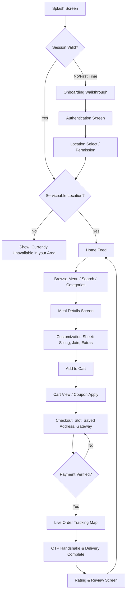
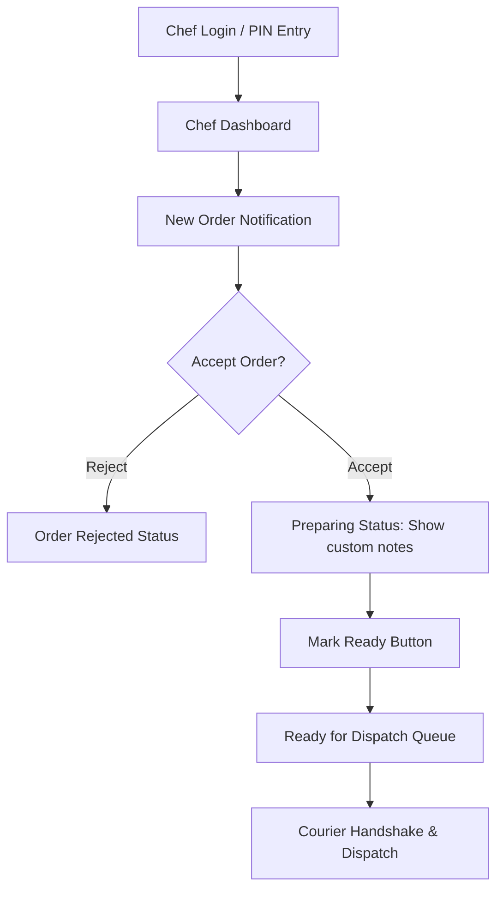

# UI_FLOW.md - Interface Flow & Navigation Specification

This document maps the user interfaces, screen routing paths, and key interactive workflows for all application roles in **Parabdi**.

---

## 1. UI/UX Design System

The visual design system of Parabdi is crafted around a premium, modern, food-focused, and culturally authentic Gujarati identity. The interface is optimized to be mobile-first and intuitive.

### Design Principles
* **Typography:** Primarily Google Fonts (`Outfit` or `Inter`). Default system sans-serif fonts should not be used.
* **Aesthetics:** Warm, rich color palette (warm amber/green HSL tailored colors), clean card shadows, smooth gradients, large high-quality food imagery, and prominent call-to-action (CTA) buttons.
* **Micro-Animations:** Use subtle animations for interactive components (buttons scale on hover, lists fade in with slight delay, loading states use custom spinner icons) to make the experience feel reactive and alive.
* **No Placeholders:** All lists and media elements must render actual content or high-quality generated illustration assets.

---

## 2. UI States Required

Every major screen across the entire system must handle and display standard state variations cleanly rather than presenting blank sheets:
* **Loading State:** Shimmer effects or animated custom brand indicators.
* **Empty State:** Detailed empty screens with illustrations or custom icons and warm, descriptive subtitles (e.g., "No orders yet" instead of blank lists).
* **Error State:** Human-readable explanations and action recovery buttons.
* **Success State:** Micro-animated checkmarks for order placement and verification.
* **Offline/Network Error State:** Banner alert indicating lost connection and auto-retry options.
* **Disabled State:** Visual gray-out and lock status for buttons during server requests.

---

## 3. Customer Mobile Interface (Flutter)

The customer app uses `go_router` for route definition, and `flutter_riverpod` for layout state management.

### 3.1 Router Tree (`go_router`)
```
/ (SplashScreen)
│
├── /onboarding (Intro walkthrough sliders)
├── /auth (Mobile Input & OTP Login screen)
├── /location (Location Selection: GPS detect, search, map pin)
│
└── /home (Main navigation wrapper with BottomNavBar — 5 tabs)
    ├── Tab 1: /home (Feed: Banners, Categories, Specials, Shorts link)
    ├── Tab 2: /menu (Explore: Search, Grid, Filters)
    ├── Tab 3: /shorts (Food Shorts: Vertical video feed)
    ├── Tab 4: /orders (Orders: Ongoing + History)
    ├── Tab 5: /profile (Profile: Wallet, Settings, Addresses)
    │
    ├── /meal/:id (Meal Details: Customization bottom sheet, add-to-cart)
    ├── /cart (Shopping Cart: Coupon apply, charge breakdown)
    ├── /checkout (Checkout: Address, slot, payment)
    ├── /track/:orderId (Order Tracking: Status timeline, OTP display)
    ├── /addresses (Address CRUD: Add/Edit/Delete addresses)
    ├── /address/add (Add New Address: Map pin, Google Places search)
    ├── /address/:id/edit (Edit Address)
    ├── /search (Search Results: Full screen with filters)
    ├── /wishlist (Wishlist: Saved favorite items)
    ├── /shorts/:id (Short Detail: Video player, Order Now button)
    ├── /rate/:orderId (Rating & Review: Stars, comment, images)
    ├── /subscription/:id (Subscription Detail: Plan info, calendar, skip/pause)
    ├── /notifications (Notification History: List with read/unread)
    └── /profile/edit (Edit Profile: Name, email)
```

**Bottom Navigation Bar (5 tabs):**
1. **HOME** — Feed with banners, categories, today's specials
2. **MENU** — Searchable food grid with filters
3. **SHORTS** — Vertical scrolling food video feed
4. **ORDERS** — Ongoing and past orders
5. **PROFILE** — Personal info, wallet, settings, addresses

### 3.2 Splash Screen
On application launch, the splash screen displays the Parabdi logo and the subtitle: *"Pure Veg Gujarati Cloud Kitchen"*. The app must run the following checks before routing:
1. Check app configuration and backend health.
2. Check maintenance mode status (block access if active).
3. Check authentication status (JWT token validity).
4. Check stored user session locally.
5. Load required settings.
6. Navigate to Onboarding (if first run), Login, or Customer Home.

### 3.3 Onboarding Walkthrough
For first-time users, 3 sequential onboarding screens explain the core value:
* **Screen 1:** "Welcome to Parabdi" (Introducing authentic Gujarati kitchen).
* **Screen 2:** "Fresh Gujarati Food" (Sourced and prepared using clean, pure veg standards).
* **Screen 3:** "Order Easily" (Delivered right to your doorstep).
* **Action Button:** "Get Started" triggers redirection to the Authentication Screen.

### 3.4 Location Selection
Users must grant location permission to use the application. The flow involves:
* Auto-detecting coordinates using current GPS location.
* Searching specific address names via Google Places autocomplete.
* Manually dragging a map pin to adjust coordinates.
* Saving addresses with labels: **Home**, **Office**, or **Other**.
* Each saved address profile stores: Contact Name, Phone, Address Line, Area, City, State, Pincode, Latitude, and Longitude.

### 3.5 Customer Bottom Navigation
The bottom navigation bar contains five main tabs:
* **HOME:** Feed showing banner carousels, category grid, today's specials, and shorts links.
* **MENU:** Searchable list of food with filters (Jain, Rating, Price).
* **SHORTS:** Full-screen vertical scrolling food video feed.
* **ORDERS:** History list of current and past orders.
* **PROFILE:** Personal details, saved addresses, wallet balance, and settings.
* *Note: The Shopping Cart is a floating action button or header trigger, not a bottom nav tab.*

---

## 3A. Missing Screens Specification

### Location Selection Screen (`/location`)
**Purpose:** First-time location setup and address selection.
**Components:**
- "Use Current Location" button (triggers GPS via `geolocator`)
- Address search bar (calls `POST /api/v1/places/search` for Google Places autocomplete)
- Google Map with draggable pin
- Address form: Label (Home/Work/Other), Contact Name, Phone, Address lines, City, State, Pincode
- "Deliver Here" button (validates against delivery radius)
**Flow:** GPS → Search → Pin adjust → Save → Check serviceability → Home or "Out of Service" message

### Address Management Screen (`/addresses`)
**Purpose:** View, add, edit, delete saved addresses.
**Components:**
- List of saved addresses with label, full address, phone
- Default address badge
- Swipe to delete, tap to edit
- "Add New Address" button → `/address/add`
- Max 10 addresses per user

### Food Shorts Screen (`/shorts`)
**Purpose:** Vertical scrolling video feed of food preparation.
**Components:**
- Full-screen vertical PageView
- Auto-play/pause on viewport entry/exit
- Like button (heart icon, toggles)
- Save button (bookmark icon, toggles)
- "Order Now" button → navigates to `/meal/:foodItemId`
- Caption overlay
- Share button

### Search Results Screen (`/search`)
**Purpose:** Dedicated search with advanced filters.
**Components:**
- Search bar with auto-focus
- Filter chips: Veg Only, Jain, Fasting, Price Range, Rating, Sort (Popularity/Price/Rating)
- Results grid (same card format as menu)
- Empty state: "No dishes found for your search"

### Wishlist Screen (`/wishlist`)
**Purpose:** View saved favorite food items.
**Components:**
- Grid of wishlisted food items
- Remove from wishlist (swipe or icon tap)
- Tap → `/meal/:id`
- Empty state: "No favorites yet — tap the heart icon on any dish"

### Rating & Review Screen (`/rate/:orderId`)
**Purpose:** Rate and review delivered orders.
**Components:**
- Star rating selector (1-5, tap to set)
- Comment text field (optional)
- Image picker (optional, max 5 images, max 3MB each)
- "Submit Review" button
- Success state: "Thank you for your feedback!"

### Subscription Detail Screen (`/subscription/:id`)
**Purpose:** View and manage an active subscription.
**Components:**
- Plan name, price, duration
- Calendar view showing delivery days and skip dates
- Meals remaining counter
- Pause/Resume button
- Skip Tomorrow button (disabled after 9 AM cutoff)
- Cancel subscription button (with confirmation dialog)

### Notification History Screen (`/notifications`)
**Purpose:** View all push notification history.
**Components:**
- List of notifications with title, body, timestamp
- Read/unread indicator (dot badge)
- Tap to navigate to related screen (order, promotion, etc.)
- "Mark All Read" button
- Empty state: "No notifications yet"

### Edit Profile Screen (`/profile/edit`)
**Purpose:** Edit user profile information.
**Components:**
- Full name text field
- Email text field (optional)
- Phone number (display only, not editable)
- "Save Changes" button

### Chef Panel Screens (Flutter/Web)
**Purpose:** Kitchen tablet interface for order management.
**Screens:**
1. **Login/PIN Entry** — 4-6 digit PIN authentication
2. **Dashboard** — Today's stats (orders accepted, avg cooking time, pending count)
3. **Incoming Orders** — New order cards with timer, Accept/Reject buttons
4. **Cooking Pipeline** — Orders in `preparing` status with custom notes, "Mark Ready" button
5. **Ready Queue** — Finished orders waiting for pickup
6. **Inventory** — Toggle food items in/out of stock
7. **Profile** — Settings, logout

### Admin Panel Screens (React/Next.js)
**Purpose:** Full administrative dashboard.
**See:** `ADMIN_PANEL_ARCHITECTURE.md` for complete page specifications.

### 3.6 Customer App Flowchart



---

## 4. Chef Interface (Flutter / Web App)

A simplified, high-contrast, large touch-target interface designed to run on kitchen tablet devices.

### 4.1 Chef Navigation
The chef interface is partitioned into four quick navigation boards:
* **DASHBOARD:** Summary showing today's statistics (orders accepted, average cooking time, busy hours).
* **ORDERS:** Main pipeline containing the list of new and preparing orders.
* **READY:** Dispatch queue showing finished dishes waiting for courier pickup.
* **PROFILE:** Account settings and quick toggle buttons for kitchen online availability.

### 4.2 Chef Flow Chart


### 4.3 Chef Screen details
* **Incoming Queue:** Lists card cards of new orders with timers. Chef can accept or reject.
* **Cooking Pipeline:** Displays active orders in `Preparing` status with custom notes (e.g. "Jain Option", "Less Oil"). Includes a "Mark Ready" button to notify the delivery boy.
* **Inventory Control:** Panel where the chef toggles items in-stock or out-of-stock instantly based on ingredient availability.

---

## 5. Delivery Boy Interface (Flutter App) [TEMPORARILY COMMENTED OUT / DISABLED]

> *Notice: Delivery Boy interface and rider navigation flows are temporarily disabled from active scope per client instruction.*

### 5.1 Rider Navigation [DISABLED]
* **HOME:** [DISABLED] Online/Offline status switch and active assigned order card.
* **DELIVERIES:** [DISABLED] Historical list of completed deliveries and logs.
* **EARNINGS:** [DISABLED] Payout details, daily ledger, and tips statistics.
* **PROFILE:** [DISABLED] Rider vehicle and registration parameters.

### 5.2 Delivery Flow Chart [DISABLED]
*(Temporarily paused - rider dispatch flow disabled)*

---

## 6. Admin Control Web Panel (React / Next.js)

Responsive side-navigation dashboard providing full administrative oversight.

### 6.1 Sidebar Tree Navigation
* **Dashboard:** Unified revenue charts, pending order speeds, and live delivery couriers map tracking.
* **Orders:** Real-time list of all orders categorized by active status, with intervention overrides.
* **Food Management:** CRUD operations on foods, price updates, discounts, customizations, and video upload.
* **Categories:** CRUD management of categories, image icons, and display ordering.
* **Customizations:** Unified customization groups and options builder.
* **Shorts:** Upload, edit, publish, and delete food shorts and thumbnails.
* **Banners:** Upload and link banners to specific foods or categories.
* **Customers:** View profiles, wallet transaction logs, and manage accounts.
* **Chefs:** CRUD operations on kitchen staff accounts and permission settings.
* **Riders:** CRUD operations on delivery boys, earning statements, and tracking histories.
* **Subscriptions:** Create, edit, and deactivate subscription plans.
* **Coupons:** Discount campaign configs (percentage, limits, expiry dates).
* **Reviews:** Moderation interface for customer food ratings.
* **Payments:** Gateway transactions log, refunds control, and billing references.
* **Reports:** Exportable sales reports (CSV/Excel) covering order history and customer growth.
* **Notifications:** Compose and dispatch system-wide push messages.
* **Settings:** Configuration panel for kitchen coordinates, opening times, GST rates, delivery fees, and maintenance mode.

---

## 7. Final System Structural Overview

The Parabdi platform is composed of these four frontend applications communicating through a central REST API and WebSocket gateway:

```
                  ┌──────────────────────────────────────────────┐
                  │                 ADMIN PANEL                  │
                  │              (React / Next.js)               │
                  └──────────────┬────────────────┬──────────────┘
                                 │                │
                                 │ REST API       │ WebSocket (Live Map)
                                 ▼                ▼
┌──────────────────┐       ┌────────────────────────────┐       ┌──────────────────┐
│  CUSTOMER APP    ├──────►│     NODE.JS + NESTJS       │◄──────┤   RIDER APP      │
│(Flutter Android) │ REST  │      CENTRAL SERVER        │ REST  │(Flutter Android) │
│                  │◄──────┤      (REST / WS)           ├──────►│                  │
└────────┬─────────┘       └─────────────┬──────────────┘       └────────┬─────────┘
         │                               │                               │
         │ WebSocket                     │ PostgreSQL                    │ WebSocket
         │ (Status & Courier)            ▼                               │ (GPS broadcast)
         │                         ┌────────────┐                        │
         └────────────────────────►│  DATABASE  │◄───────────────────────┘
                                   └────────────┘
                                         ▲
                                         │ REST
                                         ▼
                               ┌──────────────────┐
                               │     CHEF APP     │
                               │  (Flutter/Web)   │
                               └──────────────────┘
```
